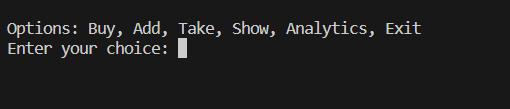
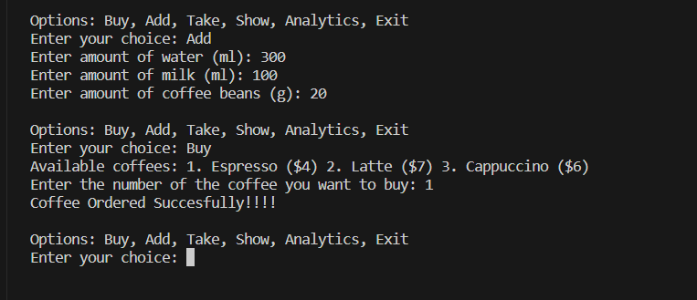
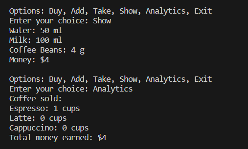
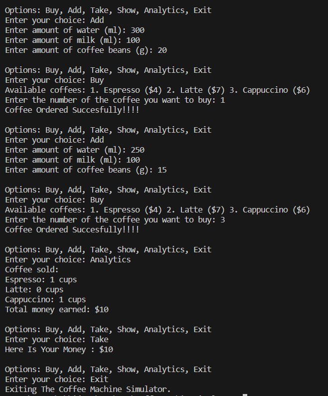

<h1 align="center"> Coffee Machine Simulator ☕</h1>

This is a Java console application that simulates a coffee machine. The program allows you to manage the coffee machine by performing various actions such as buying coffee, adding ingredients, taking money, and giving the status and analytics of the machine.


## Features
The Coffee Machine Simulator provides the following features:

- **Buy :** Allows the user to purchase different types of coffee (Espresso, Latte, Cappuccino) with their respective price. Coffee will be Orderd Successfully only if there are enough ingredients in the machine.

  1. Espresso : price - $4/cup, water needed – 250 ml/cup, milk needed – 0 ml/cup, beans needed - 16/cup

  2. Latte : price - $7/cup, water needed – 350 ml/cup, milk needed – 75 ml/cup, beans needed - 20/cup

  3. Cappuccino : price - $6/cup, water needed – 200 ml/cup milk needed – 100 ml/cup beans needed - 12/cup.

- **Add :** Enables the user to add more ingredients (water, milk, beans) to the coffee machine.

- **Show coffee Ingredient :** Displays the current status of the coffee machine, including the amount of water, milk, coffee beans, and money earned.

- **Analytics :** Shows the total earnings, and the total amount of ingredients consumed.

## Getting Started
To run the Coffee Machine Simulator, follow these steps:

1.Ensure you have Java installed on your system.

2.Download the source code files or clone the repository.

3.Compile the Java source files using the following command:
``` bash 
javac Main.java
```
4.Run the application with the following command:

```bash 
java Main
```
5.Follow the on-screen instructions to interact with the Coffee Machine Simulator.

## Usage

Once the application is running, you will be presented with a menu of actions to choose from. Enter the corresponding number for the action you want to perform:









## Video Explanation
https://drive.google.com/file/d/1JGPA59o_lwjZDOpdmjYpzsiyUxzisaey/view?usp=sharing

## OOPS Concepts Used
In the Coffee Machine Simulator code provided, several Object-Oriented Programming (OOP) concepts have been utilized. Here are the OOP concepts used in the implementation:

1.Classes and Objects:

- The **`CoffeeMachine`** class represents the coffee machine and encapsulates its state and behavior.
- The **`Main`** class contains the main method and serves as the entry point of the program.

2.Encapsulation:

- The **`CoffeeMachine`** & **`Coffee`** class encapsulates the internal state of the coffee machine, such as the amounts of water, milk, coffee beans, and money.

## Contributing
Contributions to the Coffee Machine Simulator project are welcome! If you find any bugs or have suggestions for improvement, please open an issue or submit a pull request.

## License📝
This project is generated by [@Swati Mahajan](https://github.com/mahajanswatgithub)

## Acknowledgement
The Coffee Machine Simulator was developed as an example implementation based on OOPs concepts.

## Disclaimer✍️
This Coffee Machine Simulator is a simplified program for educational purpose and does not represent a real coffee machine or its functionalities.
